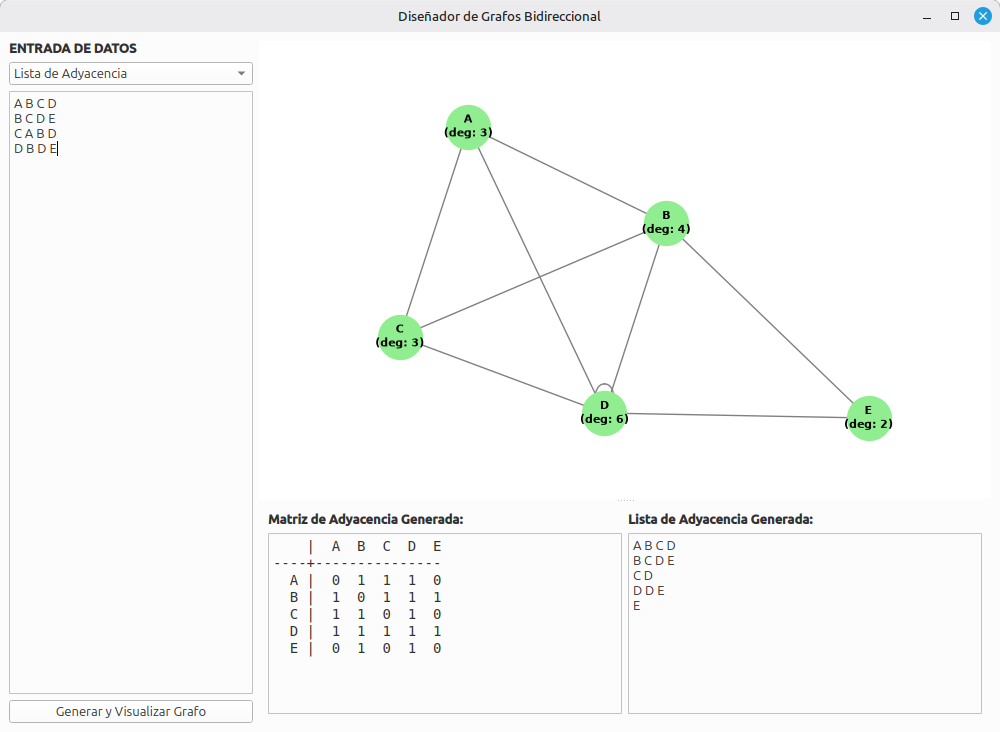

# Diseñador de Grafos Bidireccional



## 1. 📖 Sobre el Proyecto
**Diseñador de Grafos Bidireccional** es una aplicación de escritorio desarrollada en Python que facilita el estudio y análisis de topologías de red y matemáticas discretas. A través de una interfaz gráfica intuitiva, permite a los usuarios introducir estructuras de datos y visualizar instantáneamente el grafo resultante, sirviendo como un puente dinámico entre la representación visual y la representación computacional de redes no dirigidas.

## 2. ✨ Características Principales
* **Entrada de Datos Dual:** Soporta la creación de grafos mediante **Matriz de Adyacencia** o **Lista de Adyacencia**.
* **Visualización Dinámica:** Renderizado del grafo en tiempo real utilizando `NetworkX` y `Matplotlib`, con cálculo automático de la distribución de los nodos (layout).
* **Cálculo de Grados:** Muestra automáticamente el grado (`deg`) de cada vértice directamente sobre el nodo en el lienzo visual.
* **Conversión Bidireccional:** Independientemente del método de entrada, el software calcula y genera en la interfaz la Matriz de Adyacencia exacta y la Lista de Adyacencia correspondiente para su copia y análisis.

## 3. ⚙️ Instalación y Requisitos
Asegúrate de tener Python instalado en tu sistema. Para ejecutar este proyecto localmente, sigue estos pasos:

1. Clona este repositorio en tu máquina local:
```bash
   git clone [https://github.com/tu-usuario/nombre-del-repo.git](https://github.com/tu-usuario/nombre-del-repo.git)
   cd nombre-del-repo
   ```
2. Instala las dependencias necesarias utilizando el archivo `requirements.txt`:
```bash
pip install -r requirements.txt
```

3. Ejecuta la aplicación:

```bash
python Grafo1.py
```
